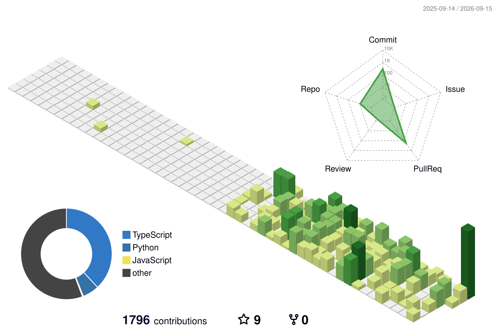

<h1 align="center">Hi there, I'm Olzhas Azirali 👋</h1>

  <b>Full-Stack Developer & Founder @ <a href="https://aziral.com">AZIRAL</a></b> 
  Building digital products from idea to production

  
  
  

---

### 🧑‍💻 About Me

- 🏢 Founder of **AZIRAL** — a product studio building web & mobile apps
- 🌍 Based in **Astana, Kazakhstan**
- 💼 Experienced in full product lifecycle: ideation → design → development → deployment
- 🎓 Open to new opportunities and collaborations
- ⚡ Passionate about clean code, automation, and AI-first engineering workflows

---

### 🛠 Tech Stack & Tools

  

  
  
  
  

| Category | Technologies |
|----------|-------------|
| **Frontend** | TypeScript, React, Next.js, Astro |
| **Mobile** | Flutter, Dart, React Native |
| **Backend** | Node.js, Hono, Express, Python |
| **Database** | PostgreSQL, Drizzle ORM, Meilisearch |
| **DevOps & OS** | Docker, Traefik, Linux, Self-hosted infrastructure |
| **AI & LLM Tools** | Claude (Anthropic), OpenAI Codex, Cursor, Google Antigravity, GitHub Copilot |
| **AI / ML** | AI video generation, LLM integrations, Agentic workflows |

---

### 🚀 Featured Projects

| Project | Description | Stack | Live |
|---------|-------------|-------|------|
| [**AziralPDF**](https://github.com/shutovBro/AziralPDF-app) | Self-hosted PDF platform — 50+ tools, REST API, desktop app | Java 25 · Spring Boot · React · TypeScript · Docker | [Demo](https://huggingface.co/spaces/shutovBro/aziralpdf) |
| [**AZIRAL CRM**](https://github.com/shutovBro/AZIRAL-CRM) | Mobile-first Business Workspace: clients, projects, tasks, money, documents | Flutter · Dart · FastAPI · PostgreSQL · Redis | [Web](https://shutovbro.github.io/AZIRAL-CRM/) |
| [**Aziral Books**](https://github.com/AZIRALGROUP/aziral-books-backend) | Book catalog aggregator — OPDS + Open Library + Internet Archive | TypeScript · Hono · PostgreSQL | — |
| [**EcoTaxi**](https://github.com/shutovBro/EcoTaxi) | Eco-friendly ride-hailing app — 22-screen passenger flow | React 19 · TypeScript · Vite · Tailwind 4 | [Demo](https://ecotaxi-mu.vercel.app) |
| [**AI Video Generator**](https://github.com/shutovBro/aziral-video-gen) | Topic → finished marketing short: script, footage, voice-over, subtitles | Python · FastAPI · Streamlit · moviepy · LLMs | [Demo](https://huggingface.co/spaces/shutovBro/aziral-video-gen) |
| [**Solidcore**](https://github.com/shutovBro/Solidcore) | Employee onboarding, training, tests & mood analytics — employee + admin workspaces | React 18 · TypeScript · Vite · Tailwind 4 | [Demo](https://shutovbro.github.io/Solidcore/) |

---

### 📊 GitHub Activity & Stats

  <picture>
    <source media="(prefers-color-scheme: dark)" srcset="profile-3d-contrib/profile-night-rainbow.svg">
    
  </picture>

  <picture>
    <source media="(prefers-color-scheme: dark)" srcset="https://raw.githubusercontent.com/shutovBro/shutovBro/output/github-snake-dark.svg">
    
  </picture>

  

---

  <i>"Code is like humor. When you have to explain it, it's bad."</i> — Cory House

